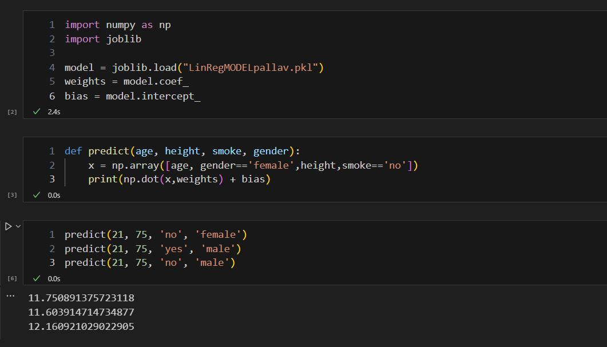

# Lung-Tidal-Capacity-Model
A simple linear regression model to predict Tidal Lung Capacity from Age, Height, Gender and other symptoms

## HOW TO RUN THE MODEL
- Use the predict function in TrainedDemo.ipynb file to use the model. 
- The model was made/trained in linearregressionmodel.ipynb file, the trained model was saved as LinRegMODELpallav.pkl and Is loaded in the TrainedDemo.ipynb notebook.
- The archive folder contains the RandomForestRegression model which was scrapped, along with a notebook similar to TrainedDemo.ipynb equipped with a predict function.

## DATASET
Initially I was looking for a dataset on kaggle but couldn't find a relevent one.

Then I found the dataset on data.world https://data.world/swathi492/lungcap-data. It has 725 data points with Age, Height, Gender, Smoke (and Caesarean) as the 5 input features and LungCap as output.

## APPROACH/ROADBLOCKS
First since we had to predict numerical values, I looked up the list of regression algorithms, I initially begun with RandomForestRegression and It gave me accuracy of 75% R2 Score and 11% pct error.  But since I didn't have experience with this model before I was not able to optimise it. 
After looking at the plots of Age and Height vs LungCap I felt the urge to just try Linear Regression knowing It wouldnt be better off than randomforest but to my surprise it gave 80% R2 score.  To Increase accuracy I dropped the column Caesarean which was insignificant boosting R2 to 83%.
 Finally the Model used Is Linear Regression.

## SCREENSHOTS AND FLOWCHARTS

